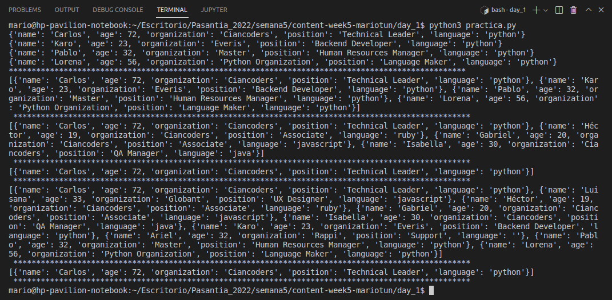

## Python intermedio
Realizar lo que se pide acontinuacion segun los datos entregados.

1. obtener todos los desarrolladores de python
2. obtener todos los desarrolladores de python que tienen una edad mayor a 20
3. obtener todos los trabajadores de ciancoders 
4. obtener todos los trabajadores de ciancoders que tienen una edad mayor a 30
5. obtener todos los trabajadores de mayores de 18 años
6. obtener todos los trabajadores de mayores a 70 años

## Ejecucion
